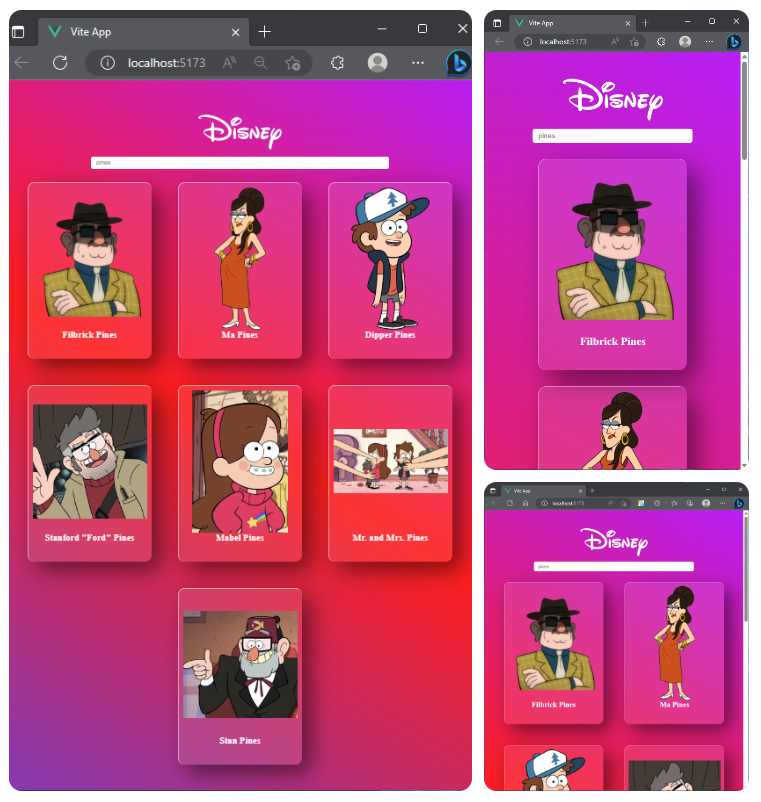

<div align="center">

# Disney API

  

This repository is an exercise from college, with the objective to consume the [Disney API](https://disneyapi.dev/).

That API is hosted on Heroku and was created by [ManuCastrillonM](https://github.com/ManuCastrillonM/disney-api).

<br />

[Getting started](#getting-started) • [Exercise](#grin-exercise) • [Project running](#open_mouth-project-running)

<br/>

</div>

## Getting started

Clone this repository using the command below

```bash
git clone https://github.com/ViniciusLucchesi/disney-api-vue.git
```

After that run

```bash
npm install
```

```bash
npm run dev
```

The `npm install` command installs the `Node.js` packages that are specified in the `package.json` file, making it simple to install all the necessary dependencies for the project to work properly.

The `npm run dev` command starts the project, uploading a local server at the URL `http://localhost:5173/` which can be accessed to view the project in operation.

# :grin: Exercise

- Create a project using **Vue**;
- Make request to `Disney API` _https://disneyapi.dev/_;
- Have a search bar to call different `endpoints`;
- Show the **name** and **image** of the characters returned by the API;
- **(Optional)** Style the page;

# :open_mouth: Project running

In this image we can see that the name of the searched character was **pines**, which is the last name of the main characters of the drawing **Gravity Falls**, thus returning the entire family of main characters that the API has.

