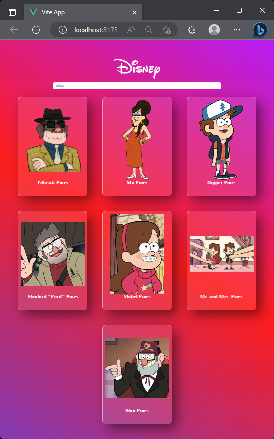
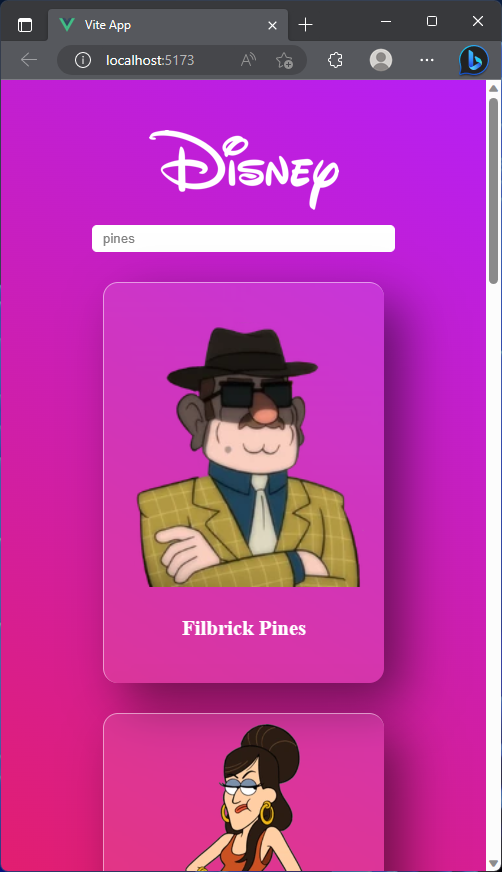
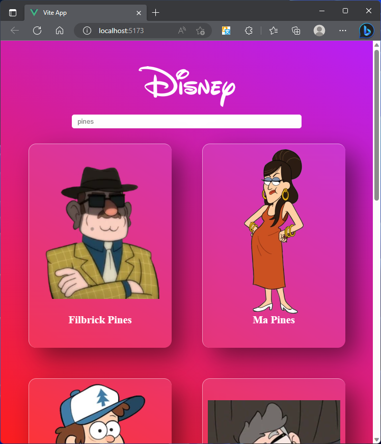

# :confused: Como rodar o projeto?

Para inicializar o projeto após ter baixado o código fonte desse respositório basta rodar os comandos listados abaixo na ordem em que estão aparacendo.

```bash
npm install
```

```bash
npm run dev
```

O comando `npm install`  instalar os pacotes do `Node.js` que estão especificados no arquivo `package.json`, tornando simples a instalação de todas as dependências necessárias para que o projeto funcione corretamente.

O comando `npm run dev` inicializa o projeto, subindo um servidor local na URL `http://localhost:5173/` que poderá ser acessada para visualizar o projeto em funcionamento.

# :grin: Do que se trata?

Esse projeto é um exercício na aula de `Eletiva II` da faculdade, onde foram impostas as seguintes condições para a conslusão do exercício:

- Criar um projeto em Vue;
- Realizar requisições para a `Disney API` _https://disneyapi.dev/_;
- Possuir uma barra de pesquisa para chamar diferentes `endpoints`;
- Mostrar o **nome** e a **imagem** dos personagens retornados pela API;
- **(Opcional)** Estilizar a página;

# :open_mouth: Imagem do projeto rodando

<div class="print">
    <p>Nesta imagem podemos ver que o nome do personagem pesquisado foi <strong>pines</strong>, que é o sobrenome dos personagens principais do desenho <strong>Gravity Falls</strong>.</p>
    <div class="layout-total">
        
        <div class="layout">
            
            
        </div>
    </div>
</div>

<style>
    .print {
        position: relative;
        display: flex;
        flex-direction: column;
        justify-content: center;
        align-items: center;
        width: 80%;
    }
    img {
        border-radius: 15px;
        object-fit: cover;
    }
    .print .layout-total {
        position: relative;
        display: flex;
        width: 95%;
    }
    .print .layout-total .layout {
        display: flex;
        flex-direction: column;
        margin-left: 15px;
        justify-content: space-between;
    }
</style>